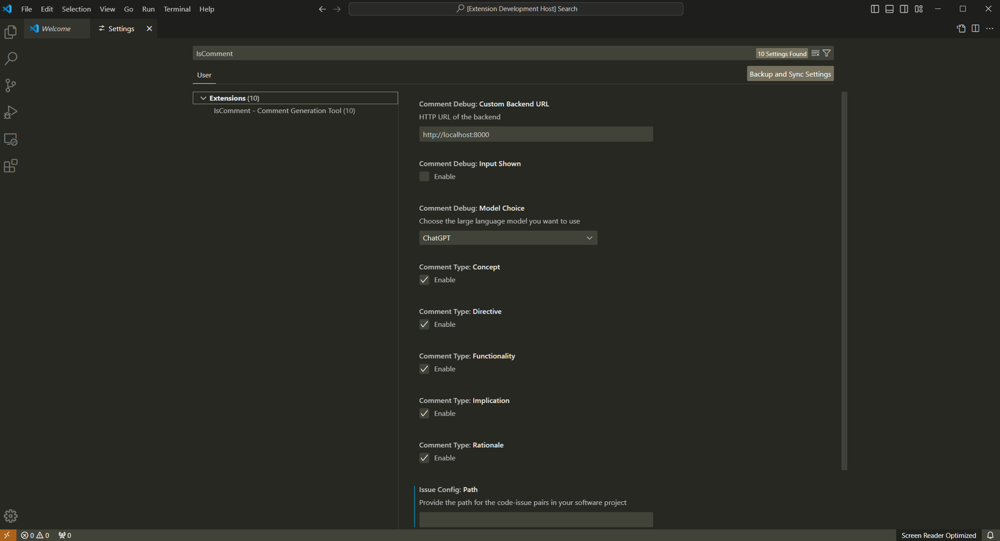
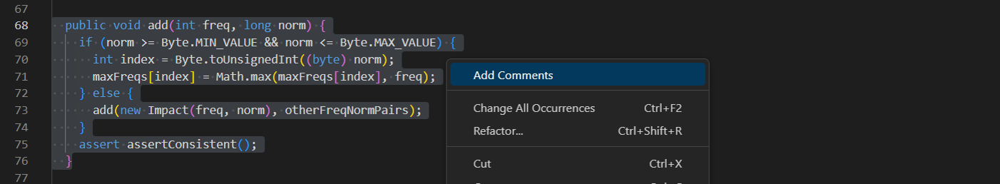
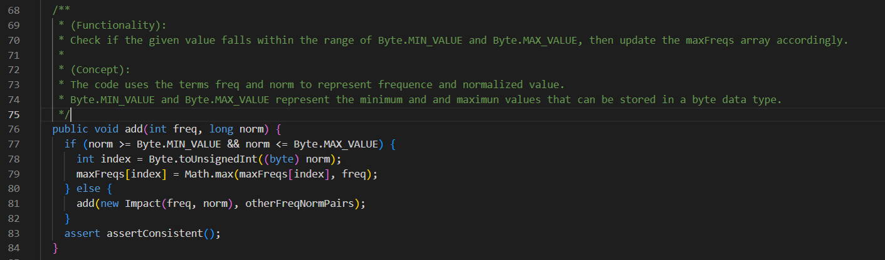

## IsComment: Issue-based LLM Retrieval Augmentation for Generating Supplementary Code Comments

Supplementary code comments can provide additional information
beyond code (e.g., design rationales) to enhance program understanding, which are highly important and valued by many developers. However, existing work, including LLMs, still struggle to
generate such code comments due to lacking the essential code supplementary information. In this paper, we propose IsComment, an
issue-based LLM retrieval augmentation approach for generating
supplementary code comments.

### Data

We propose an approach to mine those supplementary code comments whose supplementary information can be available from issue to conduct our study.

Our constructed dataset Issuecom can be accessed from the `./data` fold.

We also provide some reusable code in the `./dataCrawler` fold that can be helpful for future work to crawler more supplementary code comments and issue reports to extend the dataset for more comprehensive study.

### Script and Prompt

The code script containing the prompts to run LLMs (ChatGPT and GPT-4o) to generate supplementary code comments can be accessed from the `./prompt` fold. (Due to privacy issue, we have not provided the API key.)

The code script containing the retrievers we have explored in this paper can be accessed form the `./retriever` fold.

### Evaluation Metrics

We use three evaluation metrics provided by existing work to conduct our evaluation, including the [**SentenceBert**](https://github.com/similarityMetrics/similarityMetrics)([paper](https://arxiv.org/pdf/2204.01632.pdf)), the [**SIDE**](https://github.com/antonio-mastropaolo/code-summarization-metric)([paper](https://arxiv.org/pdf/2312.15475.pdf)) and the [**MESIA**](https://github.com/MESIA-CodeComment/MESIA)([paper](https://arxiv.org/pdf/2403.17357.pdf)). The implementation of these evaluation metrics is in the `./eval` fold. More details about these metrics and the rationale behind these metrics can be accessed from their original papers.


### IsComment Plugin

We have implemented a prototype commenting tool in the form of a Visual Studio Code Plugin. The plugin is currently under continuous improvement.

#### 1. Dependency:

```bash
  pip3 install numpy
  pip3 install requests
  pip3 install flask
  pip3 install levenshtein
```


#### 2. Run:

  （1）start backend
```bash
  cd backend
  ./start_server.sh
```
  （2）start frontend
```bash
  Press F5 to start the extention, and open the source code to be commented.
```

#### 3. Setting: search IsComment in Settings and set the configurations



```bash

  Custom Backend URL: HTTP URL of the backend
  
  Input Shown: For debugging use
  
  Model Choice: The model used in backend to generate code comments. (Currently Suppport ChatGPT)
    
  Comment Type: Type of comments to be commented

  Issue Config: Path of the issue data.

```
#### 4. Usage：





```bash
  Choose the code =》 cmd+shift+p =》 add comment
  Choose the code =》 right click =》 add comment
```

